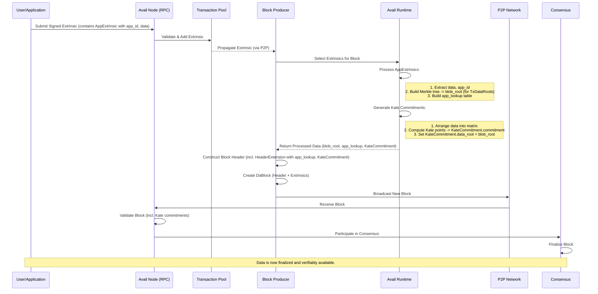
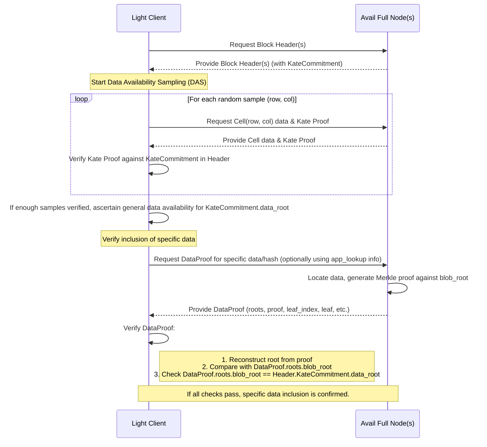

# Avail Core Protocol: User Flows

This document describes typical user flows within the Avail core protocol, focusing on how data is submitted by users/applications and how light clients verify its availability.

## 1. Data Submission Flow

This flow outlines the journey of application data from its creation to its inclusion and commitment on the Avail blockchain, making it verifiably available.

**Actors:**
*   **User/Application:** The entity wishing to submit data to Avail.
*   **Avail Node (Full Node):** A node participating in the Avail network, connected to the User/Application via RPC.
*   **Transaction Pool:** Component of the Avail Node that temporarily stores and validates incoming transactions.
*   **Block Producer:** An Avail Node selected by the consensus mechanism (e.g., BABE) to create the next block.
*   **Avail Runtime:** The state transition logic of Avail, executed by the Block Producer.
*   **P2P Network:** The communication layer between Avail nodes.

**Steps:**

1.  **Data Preparation & Extrinsic Creation:**
    *   The User/Application prepares the data it wants to submit.
    *   It (or a client library acting on its behalf) constructs an `AppExtrinsic`. This involves:
        *   Wrapping the raw `data: Vec<u8>`.
        *   Specifying its unique `app_id: AppId`. This `AppId` is crucial for later lookup and identifying data provenance.
    *   The `AppExtrinsic` is then typically signed as part of a standard Substrate extrinsic, which includes any necessary fees and sender information.

2.  **Transaction Submission:**
    *   The User/Application sends this signed extrinsic (containing the `AppExtrinsic`) to an Avail Full Node via an RPC call (e.g., `author_submitExtrinsic`).

3.  **Transaction Pool & Validation:**
    *   The Full Node receives the extrinsic.
    *   It validates the extrinsic (signature, fees, basic structure) and places it in its Transaction Pool.
    *   The extrinsic is gossiped to other nodes in the P2P network, eventually reaching the current Block Producer(s).

4.  **Block Production:**
    *   The selected Block Producer picks a set of valid extrinsics from its Transaction Pool, including the User/Application's `AppExtrinsic`.
    *   The Block Producer executes these extrinsics using the Avail Runtime:
        *   For each `AppExtrinsic`, the `data` is extracted.
        *   The Runtime collects all data from `AppExtrinsic`s (and potentially other data sources like bridged messages).
        *   This collected data is used to construct a Merkle tree, resulting in a `blob_root` (as part of `TxDataRoots`). This `blob_root` specifically commits to all application-submitted data.
        *   The `app_id` from each `AppExtrinsic` is used along with information about the data's location/index to build the `app_lookup` structure.

5.  **Kate Commitment Generation:**
    *   The same collected application data (that formed the `blob_root`) is arranged into a 2D matrix (dimensions `rows` x `cols`).
    *   The Avail Runtime computes the Kate commitments over this matrix.
    *   A `v3::KateCommitment` struct is created, containing:
        *   `rows`, `cols`.
        *   The serialized Kate `commitment` (polynomial commitment points).
        *   The `data_root`, which **must be identical** to the `blob_root` calculated in the previous step.

6.  **Block Header Construction:**
    *   The Block Producer constructs the block header (`Header`). This header includes:
        *   Standard fields: `parent_hash`, `number`, `state_root`, `extrinsics_root` (which commits to the raw extrinsics themselves).
        *   The `HeaderExtension` (specifically `v3::HeaderExtension`), which contains:
            *   The `app_lookup` structure.
            *   The `v3::KateCommitment` (with its `rows`, `cols`, `commitment`, and `data_root`).

7.  **Block Creation & Propagation:**
    *   The `DaBlock` is formed with the constructed `Header` and the vector of included `Extrinsic`s.
    *   The Block Producer broadcasts this new `DaBlock` to the P2P network.

8.  **Block Validation & Finalization:**
    *   Other Full Nodes receive the block, validate it (including verifying the Kate commitments, `app_lookup`, `TxDataRoots` consistency, etc.).
    *   The block eventually gets finalized by the consensus mechanism (e.g., GRANDPA). Once finalized, the data is considered irreversibly available.

**Summary of Data Path:**
`AppExtrinsic.data` -> Merkle Tree for `blob_root` -> 2D Matrix for Kate -> `KateCommitment.commitment` & `KateCommitment.data_root` (matches `blob_root`).

### Data Submission Flow Diagram

## 2. Data Verification Flow (Light Client Perspective)

This flow describes how a light client, without downloading entire blocks, can verify that data is available and, if needed, confirm the inclusion of specific data.

**Actors:**
*   **Light Client:** A resource-constrained client wishing to verify data on Avail.
*   **Avail Full Node(s):** Nodes that store the full block data and serve requests from Light Clients (via RPC or a specialized P2P protocol).

**Steps:**

**Part A: Verifying General Data Availability (Data Availability Sampling - DAS)**

1.  **Fetch Block Headers:**
    *   The Light Client connects to one or more Avail Full Nodes.
    *   It subscribes to new block headers or fetches specific headers it's interested in. Each `Header` contains the `HeaderExtension` with the `KateCommitment` (including `rows`, `cols`, `commitment` points, and `data_root`).

2.  **Perform Data Availability Sampling (DAS):**
    *   For a given header, the Light Client decides to sample a certain number of cells from the data matrix to gain confidence in data availability. The number of samples can be adjusted based on the desired security level.
    *   For each sample:
        *   The Light Client randomly selects cell coordinates `(row, col)` within the dimensions (`KateCommitment.rows`, `KateCommitment.cols`) specified in the header.
        *   It requests the data content of this `Cell` and its corresponding Kate `Proof` from a Full Node. (This request typically goes over P2P, but could also be an RPC call).
    *   **Full Node Response:** The Full Node retrieves the requested `Cell` data from its stored block and generates/retrieves the Kate proof for that cell against the block's Kate commitment. It sends the `Cell` data and its `Proof` back to the Light Client.

3.  **Verify Cell Proofs:**
    *   For each received `(Cell, Proof)` pair, the Light Client performs a cryptographic verification:
        *   It checks if the provided `Proof` is valid for the given `Cell` data and cell coordinates `(row, col)`, using the public `KateCommitment.commitment` (the Kate points) from the block header.
    *   If a proof verification fails, the Light Client might mark the Full Node as unreliable or increase its sampling.

4.  **Ascertain Availability:**
    *   If the Light Client successfully verifies a sufficient number of randomly sampled cell proofs (e.g., 75% of k samples are verified), it gains high statistical confidence that *at least* a significant portion (e.g., >50%) of the entire data matrix is available with the network's honest full nodes.
    *   This implies that the data corresponding to `KateCommitment.data_root` is available.

**Part B: Verifying Specific Data Inclusion (Merkle Proof)**

Once the Light Client is confident about general data availability for a block (thanks to DAS), it might want to verify if a *specific piece of data* (e.g., its own transaction) was included in that block.

5.  **Identify Target Data and `AppId`:**
    *   The Light Client knows the `AppId` and potentially the content or hash of the specific data it's looking for.

6.  **Utilize `app_lookup` (Optional but Efficient):**
    *   The `app_lookup` table in the `HeaderExtension` provides information about which data cells or transaction indices belong to which `AppId`.
    *   The Light Client can request parts of the `app_lookup` structure from a Full Node to quickly narrow down where its data *should* be if it was included. This can help in determining the `leaf_index` for the Merkle proof.

7.  **Request `DataProof` (Merkle Proof):**
    *   The Light Client requests a `DataProof` for its specific data (or its hash) from a Full Node. This request would typically include:
        *   The block hash or number.
        *   The hash of the data leaf it's interested in (or the data itself, for the Full Node to hash).
        *   Optionally, the `leaf_index` if known.

8.  **Full Node Generates and Responds with `DataProof`:**
    *   The Full Node locates the data, determines its `leaf_index` in the Merkle tree that formed the `blob_root` (which is the same as `KateCommitment.data_root`).
    *   It constructs the `DataProof` containing:
        *   `roots`: The `TxDataRoots` for that block (including `blob_root`).
        *   `proof`: The sibling Merkle hashes.
        *   `number_of_leaves`.
        *   `leaf_index`.
        *   `leaf`: The hash of the specific data.
    *   The Full Node sends this `DataProof` back to the Light Client.

9.  **Verify `DataProof`:**
    *   The Light Client verifies the received `DataProof`:
        *   It reconstructs the Merkle root using `DataProof.leaf`, `DataProof.leaf_index`, `DataProof.proof`, and `DataProof.number_of_leaves`.
        *   It compares this reconstructed root with `DataProof.roots.blob_root`.
        *   It also checks that `DataProof.roots.blob_root` matches the `KateCommitment.data_root` from the block header it already trusts (from DAS).
    *   If all checks pass, the Light Client has cryptographically confirmed that its specific piece of data was included in the block and is part of the dataset whose availability was verified via DAS.

### Data Verification Flow Diagram (Light Client)

